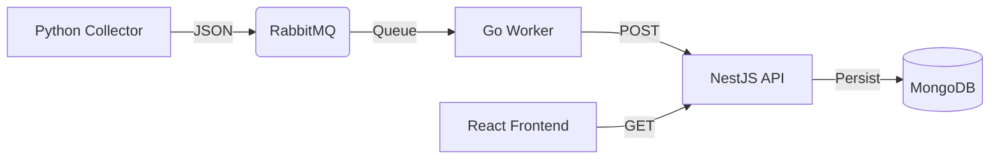

# GDASH Weather Station Challenge

Uma solução Full Stack distribuída para monitoramento climático em tempo real, utilizando arquitetura de microsserviços orientada a eventos.

<p align="center">
  <a href="https://www.python.org/" title="Python"></a>
  <a href="https://www.rabbitmq.com/" title="RabbitMQ"></a>
  <a href="https://go.dev/" title="Go"></a>
  <a href="https://nestjs.com/" title="NestJS"></a>
  <a href="https://www.mongodb.com/" title="MongoDB"></a>
  <a href="https://react.dev/" title="React"></a>
  <a href="https://www.docker.com/" title="Docker"></a>
</p>

> Coloque um print da sua tela aqui
>
> ``

## 🧭 Sobre o Projeto

Este projeto foi desenvolvido como solução para um desafio técnico de engenharia de software. O objetivo principal é criar uma arquitetura robusta e poliglota, onde diferentes serviços (cada um em sua linguagem nativa) cooperam através de um message broker para processar dados de alta volumetria.

A aplicação coleta dados meteorológicos, processa em filas de alta performance, armazena em banco orientado a documentos e exibe em um dashboard reativo.

## 🏗️ Arquitetura e Fluxo de Dados

O sistema opera em um ciclo contínuo de Extração, Processamento e Visualização:



- Coleta (Python): um script agendado busca dados da Open-Meteo API
- Mensageria (RabbitMQ): garante desacoplamento e resiliência dos dados
- Processamento (Go): um worker consume a fila e comunica com a API
- Backend (NestJS): gerencia regras de negócio e persistência no MongoDB
- Frontend (React): interface moderna com Tailwind e shadcn/ui

## 🚀 Tecnologias Utilizadas

- Infraestrutura: Docker & Docker Compose
- Coletor: Python 3.10 + `requests` + `schedule`
- Fila/Broker: RabbitMQ (Management Plugin)
- Worker: Golang (AMQP Protocol)
- API: NestJS (TypeScript) + Mongoose
- Banco de Dados: MongoDB
- Frontend: React + Vite + TailwindCSS + Recharts

## 📦 Como Rodar (Instalação)

Graças ao Docker, não é necessário instalar Python, Go ou Node.js na sua máquina. Apenas o Docker é obrigatório.

### Pré-requisitos

- Docker Desktop instalado e rodando

### Passo a Passo

1. Clone o repositório:

```bash
git clone https://github.com/SEU-USUARIO/gdash-weather-station.git
cd gdash-weather-station
```

2. Suba a aplicação com um único comando:

```bash
docker compose up --build
```

Na primeira execução, aguarde o download das imagens e a compilação dos serviços.

3. Acesse as interfaces:

- Dashboard (Frontend): `http://localhost:5173`
- API (Backend): `http://localhost:3000/api`
- RabbitMQ Manager: `http://localhost:15672` (User: `admin` / Pass: `password123`)

## 📂 Estrutura do Projeto

```
gdash-weather-station/
├── backend-nest/             # API Principal (Node.js/NestJS)
├── frontend-react/           # Dashboard (React/Vite)
├── weather-collector-python/ # Serviço de Coleta (Python)
├── worker-go/                # Consumidor da Fila (Golang)
└── docker-compose.yml        # Orquestração dos Containers
```

## ⚙️ Detalhes da Implementação

- Resiliência: o Worker em Go possui lógica de retry e ack/nack manual; se a API estiver fora do ar, a mensagem volta para a fila
- Tradução WMO: o Frontend implementa a tabela da Organização Meteorológica Mundial para traduzir códigos numéricos (ex.: `2`) para descrições humanas ("Parcialmente Nublado ⛅")
- Networking Docker: os serviços se comunicam via rede interna do Docker (`http://backend-nest:3000`, `amqp://rabbitmq`), isolados do host

## 📝 Autor

Desenvolvido por [Seu Nome]

- LinkedIn: [Seu Link do LinkedIn]
- GitHub: [Seu Link do GitHub]
